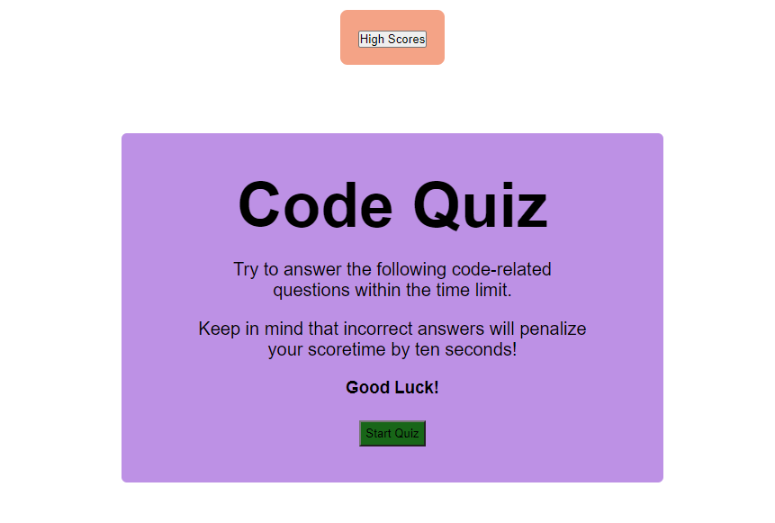
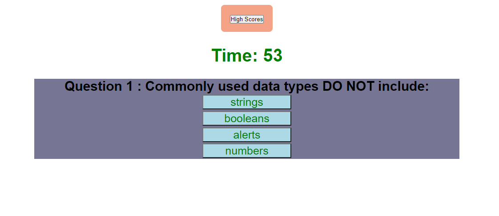
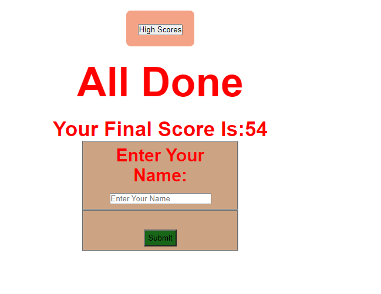
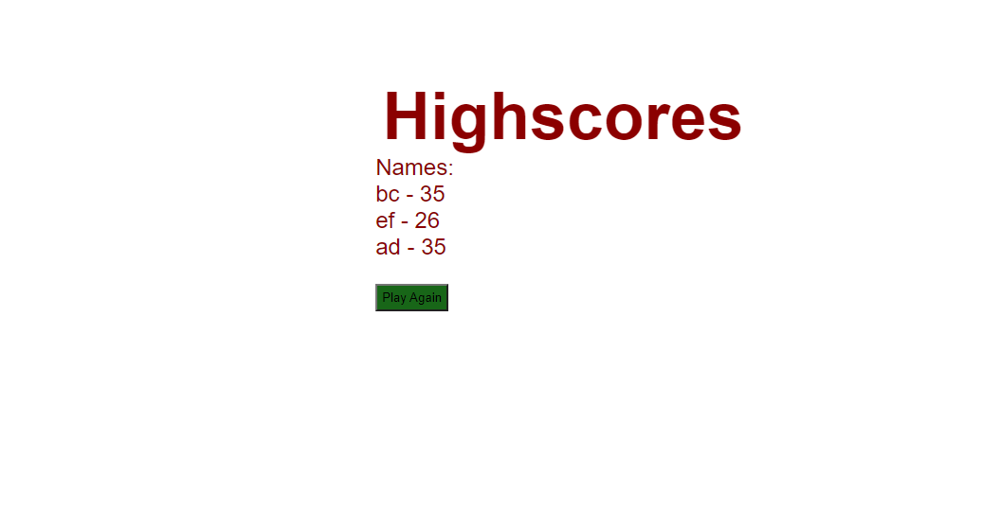

# Homework 4:codequiz

## objectives
 
Created a Beginner JavaScript quiz that ask timed questions, deducts time for wrong answers, and allows user to set initials if they have reached the highest score. 

## Screenshot of homepage

## Link to deployed page

You can also refer to this [GitHub Pages](https://github.com/SowmyaNagayya/hw02).

